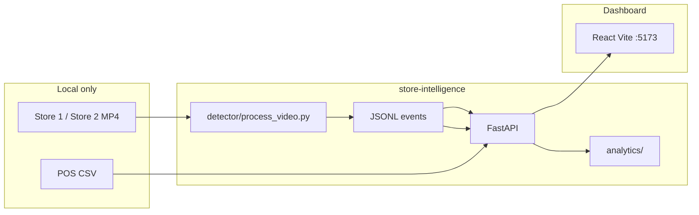
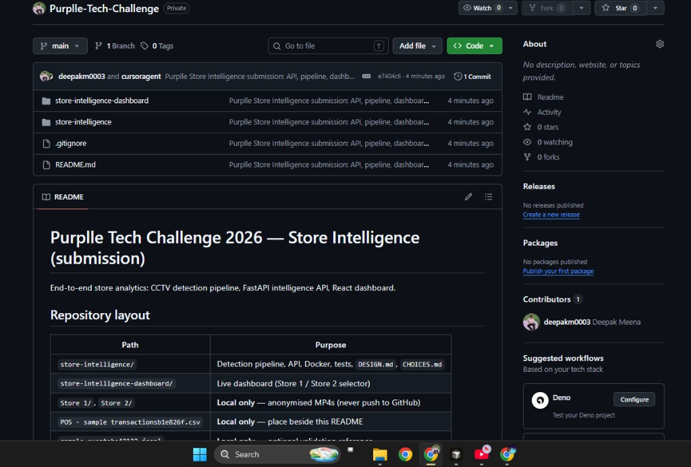

# Purplle Tech Challenge 2026 — Store Intelligence

[](https://www.python.org/)
[](https://fastapi.tiangolo.com/)
[](https://react.dev/)
[](https://docs.docker.com/compose/)

End-to-end **offline store intelligence** for specialty retail: anonymised CCTV → structured behavioural events → real-time analytics API → React dashboard. Built for Purplle Tech Challenge 2026 Round 2.

**Repository:** https://github.com/deepakm0003/Purplle-Tech-Challenge

---

## Table of contents

1. [What this system does](#what-this-system-does)
2. [Architecture](#architecture)
3. [Repository layout](#repository-layout)
4. [Prerequisites](#prerequisites)
5. [Run with Docker (recommended for reviewers)](#run-with-docker-recommended-for-reviewers)
6. [Run without Docker (local dev)](#run-without-docker-local-dev)
7. [Detection pipeline (CCTV → events)](#detection-pipeline-cctv--events)
8. [API endpoints](#api-endpoints)
9. [Dashboard (Part E — live metrics)](#dashboard-part-e--live-metrics)
10. [Screenshots — how to capture](#screenshots--how-to-capture)
11. [Stores: Store 1 vs Store 2](#stores-store-1-vs-store-2)
12. [Testing & validation](#testing--validation)
13. [Troubleshooting](#troubleshooting)
14. [Submission checklist](#submission-checklist)
15. [Further reading](#further-reading)

---

## What this system does

| Stage | Module | Responsibility |
|-------|--------|----------------|
| **1 · Detection** | `detector/` | YOLOv8 person detect, ByteTrack, zone polygons, staff heuristics, Re-ID hooks |
| **2 · Events** | `detector/event_generator.py` | Emit schema-compliant JSONL: `ENTRY`, `EXIT`, `ZONE_*`, `BILLING_*`, `REENTRY` |
| **3 · Intelligence** | `api/` + `analytics/` | Ingest, dedupe, POS correlation, metrics, funnel, heatmap, anomalies |
| **4 · Dashboard** | `store-intelligence-dashboard/` | Multi-store UI, POS + CCTV metrics, video overlay tracks |

**North-star metric:** offline conversion rate = unique visitors who purchased ÷ unique visitors (staff excluded).

**Pre-loaded data:** `store-intelligence/data/bootstrap/` contains pipeline JSONL for Store 1 and Store 2 so metrics work immediately after the API starts — no CCTV files required for review.

---

## Architecture



```text
Purplle-Tech-Challenge/
├── store-intelligence/          API · CV pipeline · Docker · tests
│   ├── api/                     FastAPI routes, bootstrap, store catalog
│   ├── detector/                YOLO + tracker + event emission
│   ├── analytics/               metrics, funnel, heatmap, anomalies
│   ├── data/bootstrap/          Committed events (reviewer-friendly)
│   └── docker-compose.yml       postgres + redis + api
└── store-intelligence-dashboard/   React UI
```

### Event schema (summary)

Each line in JSONL matches the challenge contract:

```json
{
  "event_id": "uuid-v4",
  "store_id": "ST1008",
  "camera_id": "CAM-ENTRY",
  "visitor_id": "VIS_a1b2c3d4",
  "event_type": "ENTRY",
  "timestamp": "2026-06-04T10:00:00Z",
  "zone_id": "ENTRY",
  "dwell_ms": 0,
  "is_staff": false,
  "confidence": 0.87,
  "metadata": { "queue_depth": null, "sku_zone": null, "session_seq": 1 }
}
```

Full catalogue: `ENTRY`, `EXIT`, `ZONE_ENTER`, `ZONE_EXIT`, `ZONE_DWELL`, `BILLING_QUEUE_JOIN`, `BILLING_QUEUE_ABANDON`, `REENTRY`.

---

## Repository layout

<details>
<summary><strong>Backend — store-intelligence/</strong></summary>

| Path | Role |
|------|------|
| `api/main.py` | App factory, `/health`, static media mounts |
| `api/bootstrap_data.py` | Load bootstrap JSONL + POS on startup |
| `api/routes/analytics.py` | Ingest, metrics, funnel, heatmap, anomalies |
| `api/routes/stores.py` | Dashboard, cameras, POS per store |
| `api/services/store_catalog.py` | `config/stores.json` → paths & cameras |
| `detector/process_video.py` | Single-clip CLI processor |
| `detector/entry_backfill.py` | Derive `ENTRY` when pipeline only emitted dwell |
| `scripts/process_stores.py` | Batch Store 1 + Store 2 |
| `config/stores.json` | `ST1008`, `ST2002` camera definitions |
| `DESIGN.md` / `CHOICES.md` | Architecture & engineering decisions |

</details>

<details>
<summary><strong>Frontend — store-intelligence-dashboard/</strong></summary>

| Path | Role |
|------|------|
| `src/context/StoreContext.tsx` | Store 1 / Store 2 selector |
| `src/pages/BrigadeOverview.tsx` | Overview + CCTV summary |
| `src/pages/POSAnalytics.tsx` | Sales & intelligence |
| `src/pages/StoreCCTV.tsx` | Video + track overlay |
| `src/services/apiClient.ts` | API base URL + store id |

</details>

### Local dataset (not in git)

Place beside the cloned repo on your machine:

```text
Purple Tech Hiring Challenge/
├── Store 1/                              # CAM 3 entry, CAM 1/2 zone, CAM 5 billing
├── Store 2/                              # entry 1/2, zone, billing_area
├── POS - sample transactionsb1e826f.csv
├── sample_eventsbe42122.jsonl
└── Purplle-Tech-Challenge/               # this git repo
```

---

## Prerequisites

| Tool | Version | Notes |
|------|---------|--------|
| **Docker Desktop** | Latest | Required for acceptance-gate `docker compose up` |
| Python | 3.11+ | Local API / pipeline without Docker |
| Node.js | 18+ | Dashboard |
| Git | Any | Clone repo |

Optional: NVIDIA GPU for faster YOLO inference (`--model nano` works on CPU).

---

## Run with Docker (recommended for reviewers)

### Step 1 — Install Docker Desktop

1. Download [Docker Desktop for Windows](https://www.docker.com/products/docker-desktop/).
2. Install and **restart** the PC if prompted.
3. Open Docker Desktop and wait until it shows **Engine running**.

### Step 2 — Clone and start the stack

**PowerShell or Command Prompt:**

```powershell
git clone https://github.com/deepakm0003/Purplle-Tech-Challenge.git
cd Purplle-Tech-Challenge\store-intelligence
docker compose up -d --build
```

First build may take **5–15 minutes** (downloads Python image + `pip install`).

### Step 3 — Verify services

```powershell
docker compose ps
```

Expected: `store_intelligence_api`, `store_intelligence_db`, `store_intelligence_redis` — state **running** / **healthy**.

```powershell
curl http://localhost:8000/health
```

Expected JSON: `"status": "healthy"`.

| Service | Container | Host port |
|---------|-----------|-----------|
| FastAPI | `store_intelligence_api` | **8000** |
| PostgreSQL | `store_intelligence_db` | 5432 |
| Redis | `store_intelligence_redis` | 6379 |

### Step 4 — Open Swagger UI

Browser: **http://localhost:8000/api/docs**

Try these from Swagger (click **Try it out**):

| Endpoint | Store id |
|----------|----------|
| `GET /api/analytics/stores/{store_id}/metrics` | `ST1008` or `ST2002` |
| `GET /api/analytics/stores/{store_id}/funnel` | `ST1008` |
| `GET /api/analytics/health` | — |
| `GET /api/stores/{store_id}/dashboard` | `ST1008` |

Bootstrap events load on API startup — metrics should return non-empty JSON for Store 2 visitors.

### Step 5 — Start the dashboard (optional, Part E)

**New terminal** (API keeps running in Docker):

```powershell
cd Purplle-Tech-Challenge\store-intelligence-dashboard
npm ci
npm run dev
```

Open **http://localhost:5173** — use the header to switch Store 1 / Store 2.

### Docker — common commands

```powershell
# View API logs
docker compose logs -f api

# Stop everything
docker compose down

# Stop and remove volumes (fresh DB)
docker compose down -v

# Rebuild after code changes
docker compose up -d --build
```

### POS file with Docker

For Store 1 revenue in the dashboard, copy the POS CSV into the parent folder (see layout above). The API container mounts `store-intelligence/`; bootstrap works without POS, but `ST1008` revenue needs the CSV at the path in `config/stores.json` (`pos_file`).

---

## Run without Docker (local dev)

```powershell
git clone https://github.com/deepakm0003/Purplle-Tech-Challenge.git
cd Purplle-Tech-Challenge\store-intelligence
python -m venv .venv
.\.venv\Scripts\Activate.ps1
pip install -r requirements.txt
python -m uvicorn api.main:app --reload --host 0.0.0.0 --port 8000
```

Dashboard (second terminal):

```powershell
cd ..\store-intelligence-dashboard
npm install
npm run dev
```

| Service | URL |
|---------|-----|
| Swagger UI | http://localhost:8000/api/docs |
| ReDoc | http://localhost:8000/api/redoc |
| Health | http://localhost:8000/health |
| Analytics health | http://localhost:8000/api/analytics/health |
| Dashboard | http://localhost:5173 |

---

## Detection pipeline (CCTV → events)

Run only when you have `Store 1/` and `Store 2/` videos locally.

```powershell
cd store-intelligence
python scripts/process_stores.py --export-tracks
python scripts/backfill_entry_events.py
python scripts/sync_bootstrap_events.py
python scripts/build_submission_events.py
```

Restart the API after processing so bootstrap reloads.

| Script | Purpose |
|--------|---------|
| `process_stores.py` | All cameras, both stores |
| `process_stores.py --store ST2002` | One store only |
| `backfill_entry_events.py` | Add missing `ENTRY` rows for footfall metrics |
| `sync_bootstrap_events.py` | Copy `output/` → `data/bootstrap/` for git |
| `export_store_tracks.py` | CCTV bounding-box JSON for dashboard overlay |

Single camera example:

```powershell
python -m detector.process_video `
  -v "..\Store 1\CAM 3 - entry.mp4" `
  -o output\store-1\events\CAM_3_-_entry_events.jsonl `
  --store-id ST1008 --camera-id CAM-ENTRY --camera-role entry `
  --layout config\zones.json --sample-rate 5 --confidence 0.45 --min-hits 5 `
  --entry-camera-id CAM-ENTRY
```

---

## API endpoints

### Challenge analytics (`/api/analytics`)

| Method | Path | Description |
|--------|------|-------------|
| `POST` | `/api/analytics/events/ingest` | Batch ingest, idempotent by `event_id` |
| `GET` | `/api/analytics/stores/{store_id}/metrics` | Visitors, conversion, dwell, queue |
| `GET` | `/api/analytics/stores/{store_id}/funnel` | Session funnel + drop-off % |
| `GET` | `/api/analytics/stores/{store_id}/heatmap` | Zone heatmap 0–100 |
| `GET` | `/api/analytics/stores/{store_id}/anomalies` | Active anomalies + suggested actions |
| `GET` | `/api/analytics/health` | Per-store feed freshness |

### App & dashboard (`/api/stores`)

| Method | Path | Description |
|--------|------|-------------|
| `GET` | `/api/stores` | List stores |
| `GET` | `/api/stores/{store_id}/dashboard` | POS summary + KPIs |
| `GET` | `/api/stores/{store_id}/cameras` | Cameras + pipeline status |

### Platform

| Method | Path | Description |
|--------|------|-------------|
| `GET` | `/health` | Liveness |
| `GET` | `/api/docs` | Swagger UI |
| `GET` | `/api/openapi.json` | OpenAPI schema |

**Example — metrics (PowerShell):**

```powershell
Invoke-RestMethod "http://localhost:8000/api/analytics/stores/ST2002/metrics"
```

---

## Dashboard (Part E — live metrics)

Part E asks for **at least one metric updating** as events flow — not a separate video upload.

**Recommended demo flow:**

1. `docker compose up -d --build` (or local uvicorn).
2. `npm run dev` in `store-intelligence-dashboard/`.
3. Open http://localhost:5173 → **Overview** — note CCTV visitor count.
4. Optional: replay events into the API (batch ingest still updates metrics on refresh):

```powershell
cd store-intelligence
python scripts/ingest_jsonl_events.py
```

5. Click **Refresh** on the dashboard or switch Store 1 ↔ Store 2 — metrics should change.

| Page | Route | What to show reviewers |
|------|-------|-------------------------|
| Overview | `/` | Revenue (Store 1), CCTV visitors |
| Sales & intelligence | `/sales` | POS + analytics |
| CCTV | `/cctv` | Video + detection tracks |
| Store map | `/store` | Zone layout |

`.env` (optional):

```env
VITE_API_BASE_URL=http://localhost:8000
VITE_STORE_ID=ST1008
```

---

## Screenshots — how to capture

Save PNG files under `docs/screenshots/` (width **1400–1600px** recommended). They render automatically in this README on GitHub.

| File | What to capture |
|------|-----------------|
| `01-github-repository.png` | GitHub repo file list |
| `02-dashboard-overview.png` | http://localhost:5173 — Overview |
| `03-sales-intelligence.png` | `/sales` page |
| `04-store-cctv-tracks.png` | `/cctv` with boxes on video |
| `05-store-map-heatmap.png` | `/store` floorplan |
| `06-api-swagger.png` | Swagger UI (steps below) |
| `07-docker-compose.png` | Terminal after `docker compose ps` |

### How to capture the API Swagger screenshot (`06-api-swagger.png`)

1. Start the API (`docker compose up -d --build` or `uvicorn`).
2. Open **http://localhost:8000/api/docs** in Chrome or Edge.
3. Expand **`GET /api/analytics/stores/{store_id}/metrics`**.
4. Click **Try it out** → set `store_id` to **`ST2002`** → **Execute**.
5. Confirm **200** response with `unique_visitors` > 0 in the body.
6. **Screenshot:**
   - **Windows:** `Win + Shift + S` → select the browser window (include URL bar + endpoint list + response).
   - Or browser **full page**: DevTools (`F12`) → `Ctrl + Shift + P` → type **Capture screenshot**.
7. Save as `docs/screenshots/06-api-swagger.png`.
8. Commit and push:

```powershell
git add docs/screenshots/06-api-swagger.png README.md
git commit -m "Add API Swagger screenshot"
git push origin main
```

### How to capture the Docker screenshot (`07-docker-compose.png`)

1. Run:

```powershell
cd store-intelligence
docker compose up -d --build
docker compose ps
```

2. Screenshot the terminal showing three services **running** / **healthy**.
3. Save as `docs/screenshots/07-docker-compose.png`.

### Gallery (placeholders until you add images)




---

## Stores: Store 1 vs Store 2

| | Store 1 (`ST1008`) | Store 2 (`ST2002`) |
|---|-------------------|-------------------|
| POS in sample CSV | Yes | No rows → **₹0 revenue** (expected) |
| CCTV / visitors | Bootstrap + pipeline | Bootstrap + pipeline |
| Entry cameras | `CAM-ENTRY` (1) | `CAM-ENTRY-1`, `CAM-ENTRY-2` |
| Zone config | `config/zones.json` | `config/store-2-zones.json` |

Store 2 zero revenue is a **data limitation** of the provided POS file, not an API bug.

---

## Testing & validation

```powershell
cd store-intelligence
pytest tests/unit -q
python scripts/validate_submission.py
```

Docker smoke test:

```powershell
curl http://localhost:8000/health
curl http://localhost:8000/api/analytics/stores/ST1008/metrics
```

---

## Troubleshooting

| Issue | Fix |
|-------|-----|
| `docker compose` not found | Install Docker Desktop; use PowerShell as Administrator once |
| Port 8000 in use | Stop other uvicorn: `Get-Process -Name python` or change port in `docker-compose.yml` |
| Store 2 visitors = 0 | Run `python scripts/backfill_entry_events.py` and restart API |
| Swagger 404 at `/docs` | Use **/api/docs** not `/docs` |
| Dashboard blank | Check `VITE_API_BASE_URL=http://localhost:8000` and API is running |
| Docker build slow | Normal first time; ensure stable internet for pip |
| No POS revenue | Place `POS - sample transactionsb1e826f.csv` in parent folder |

---

## Submission checklist

- [x] GitHub: https://github.com/deepakm0003/Purplle-Tech-Challenge
- [ ] Invite `purplletechchallenge2026@hackerearth.com` (private repo)
- [x] `DESIGN.md` + `CHOICES.md`
- [x] `docker compose up` documented above
- [x] Bootstrap JSONL in `data/bootstrap/`
- [x] No `Store 1/` / `Store 2/` / `*.mp4` in git
- [ ] Screenshots `02`–`07` in `docs/screenshots/`

---

## Further reading

| Document | Description |
|----------|-------------|
| [`store-intelligence/DESIGN.md`](store-intelligence/DESIGN.md) | Architecture + AI-assisted decisions |
| [`store-intelligence/CHOICES.md`](store-intelligence/CHOICES.md) | Model, schema, API trade-offs |
| [`store-intelligence/README.md`](store-intelligence/README.md) | Backend deep-dive |
| [`store-intelligence/data/README.md`](store-intelligence/data/README.md) | Where to place CSV / videos |
| [`docs/screenshots/README.md`](docs/screenshots/README.md) | Screenshot filenames |
